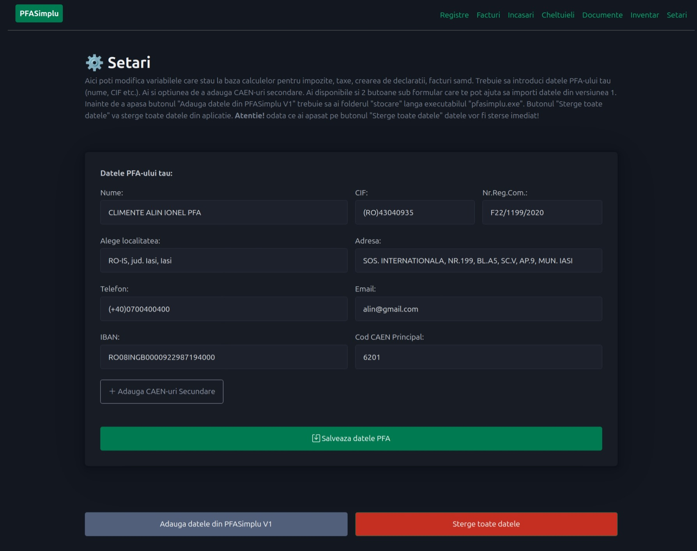

# PFASimplu V2 in progress

# Setari

In pagina `Setari` trebuie sa adaugi datele pfa-ului tau. Poti importa datele din versiunea 1.
Poti sterge toate datele. Aceasta pagina trebuie completata la prima deschidere a aplicatiei.
Cam rar vei schimba datele din aceasta pagina.

# Pentru cine este de folos aceasta aplicatie?

- Pentru cei care detin PFA, PFI, II, etc si pot tine contabilitatea in partida simpla;
- Impozitare in sistem real (fara norma de venit);
- Nu au depasit pragul TVA (venituri sub 5k euro pe luna);
- Sunt prestatori de servicii (freelanceri, instalatori, curieri glovo, tazz, soferi taxi, bold, uber etc.);

# Poate aplicatia sa faca X,Y,Z?

Aplicatia am facut-o potrivita pentru nevoile mele. Daca pe parcurs voi avea nevoie de X,Y,Z atunci poate voi actualiza aplicatia sa contina si X,Y,Z (cum am facut cu e-factura). 

# Ce fac cu versiunea veche a aplicatiei (v1)?

O poti folosi in continuare. Este actualizata cu datele pana in 2024 inclusiv.
Daca mai apar modificari de calcul al taxelor/impozitelor dupa 2024 atunci aplicatia anterioara (V1) nu mai este valabila.

**Recomand**: Versiunea 2 are si o optiune de preluare a datelor din versiunea 1. 
Tot ce trebuie sa faci este sa copii fisierul `stocare` langa executabilul `pfasimplu.exe` si din pagina `Setari` sa apesi butonul `Adauga datele din PFASimplu V1` apoi astepti cateva secunde. Doar un cont trebuie sa fie prezent in folderul stocare.

O alta optiune: Faci un zip cu aplicatia pfasimplu v1 (care contine registrele excel in folderul stocare) si il pui pe un usb stick pentru pastrare. Poti folosi pfasimplu v2 incepand cu noul an.  

# Instalare pt. utilizatori

Din sectiunea `Releases` din aceasta pagina descarca zip-ul pentru sistemul tau de operare. 
Odata descarcat click dreapta unzip si rulezi executabilul `pfasimplu.exe`.
Daca ai MacOS va trebui sa urmezi sectiunea *Instalare pt. developeri*. 

Executabilul nu are un certificat digital, asa ca sistemul de operare (windows/macos) iti va spune ca executabilul este un posibil virus sau ca este de la "un unknown publisher". Poti urma sectiunea *Instalare pt. developeri* daca vrei sa eviti asta. Sa fii safe: nu descarca acest executabil din alta locatie decat cea din acest GitHub repo!  

# Instalare pt. developeri

Aplicatia este facuta in Python, Django cu SQLiteDB. 

- clone repo;
- `virtualenv .venv`;
- `source .venv/bin/activate`;
- `pip install -r requirements.txt`;
- `make migrate-all` - pt. Ubuntu pentru a face toate migrarile;
- `make run` - pt. a porni Django dev. server (aka `python manage.py runserver`);
- `make purge-db` - pt. a sterge `stocare.db` (sqlite db) si toate folderele `migrations`;
- `make purge-migration-dirs` - pt. a sterge toate folderele `migrations`;
- `make package` - creeaza aplicatia pfasimplu ca executabil pentru sistemul de operare pe care a fost rulat;

Daca esti pe Windows fie poti muta comenzile din Makefile intr-un fisier bash (.bat), fie instalezi ceva [sa poti rula Makefile](https://stackoverflow.com/questions/2532234/how-to-run-a-makefile-in-windows). 
