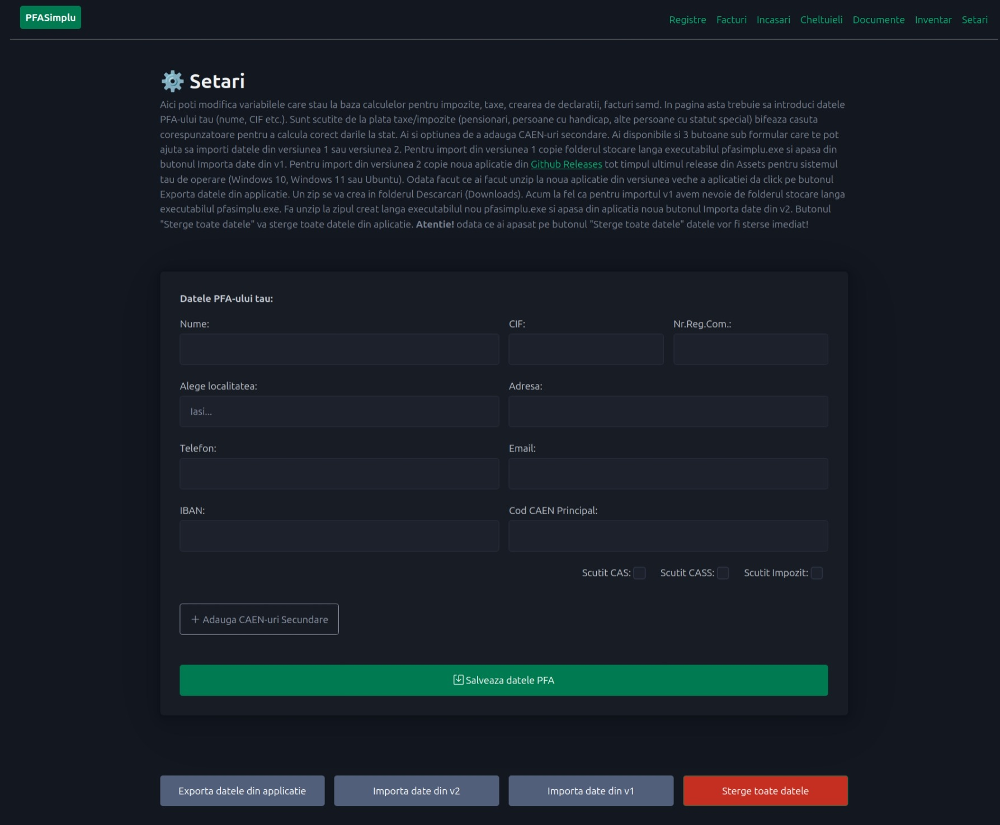
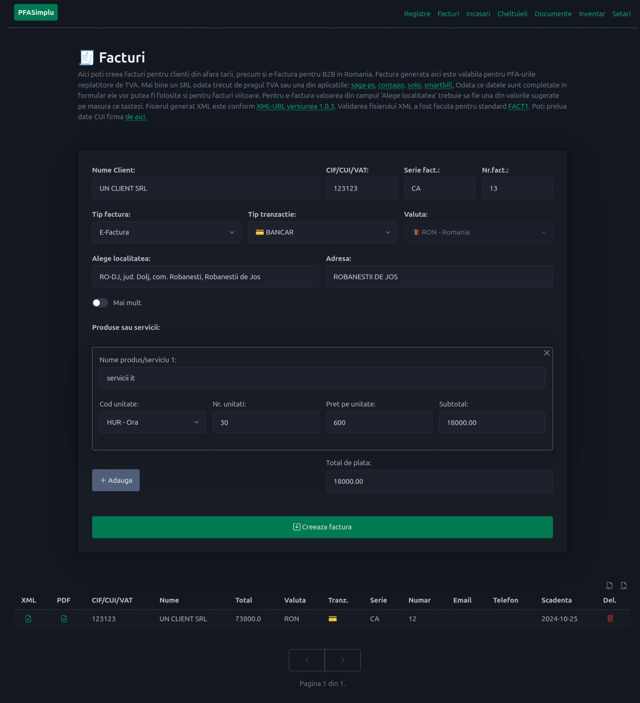
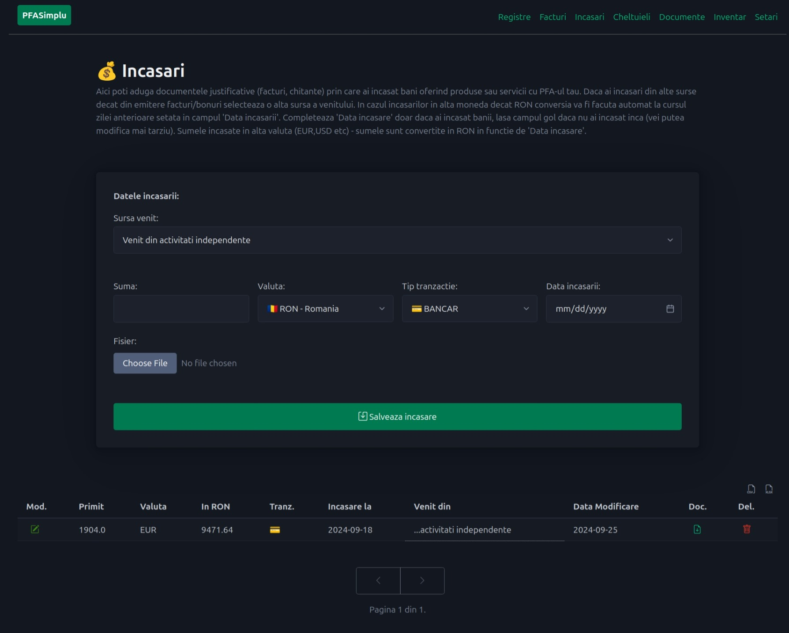
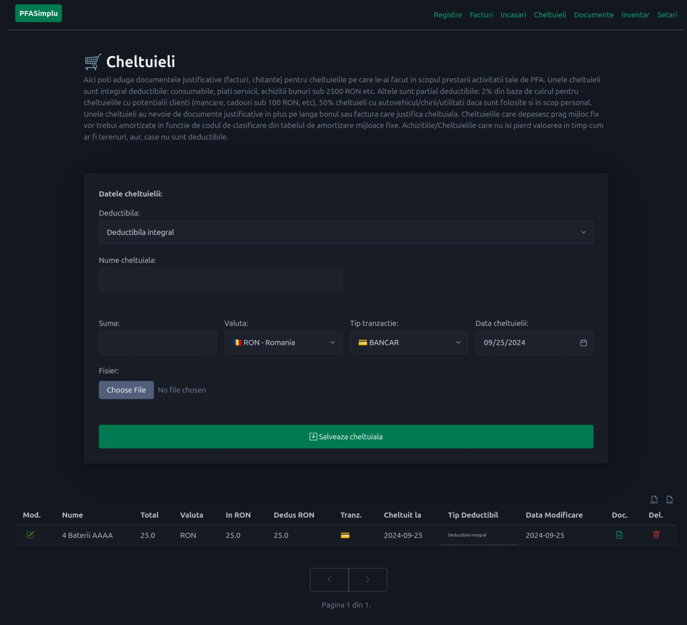
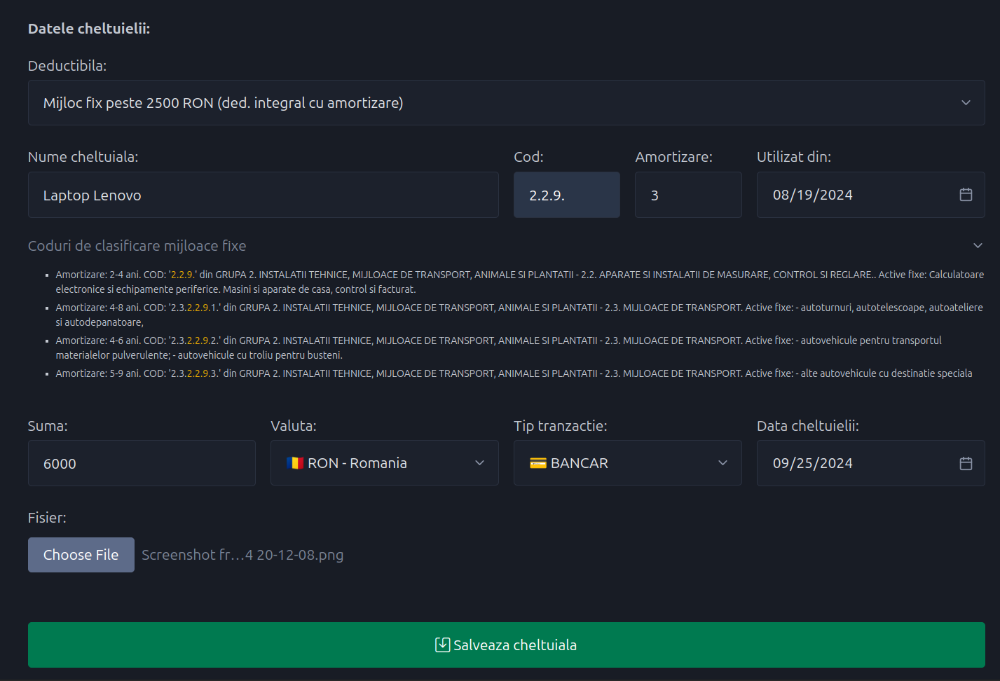
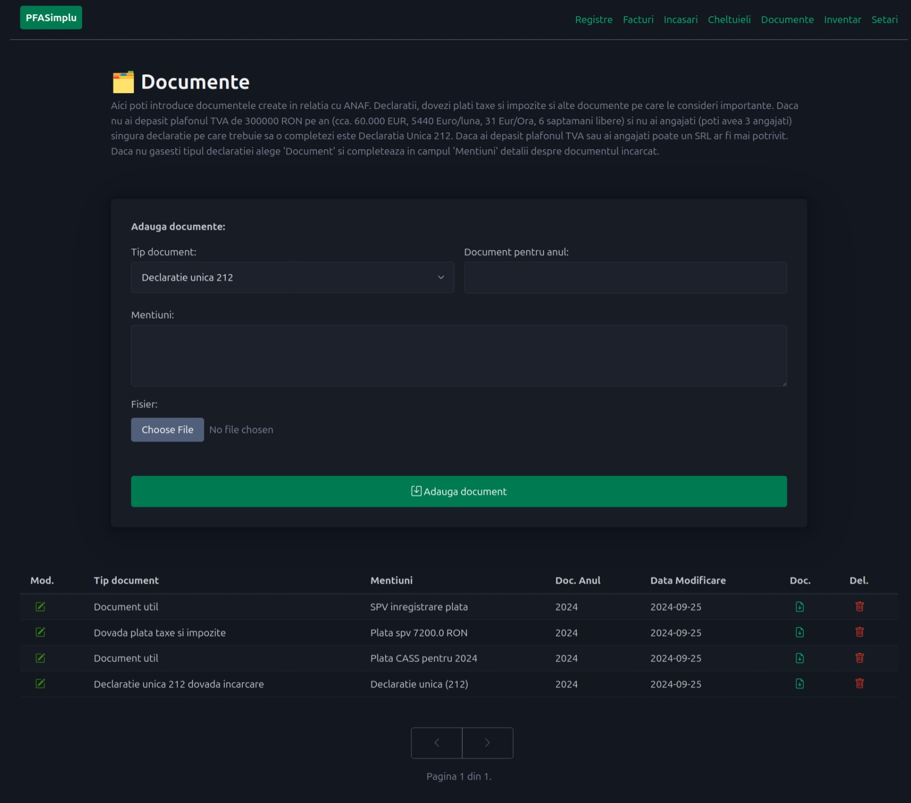
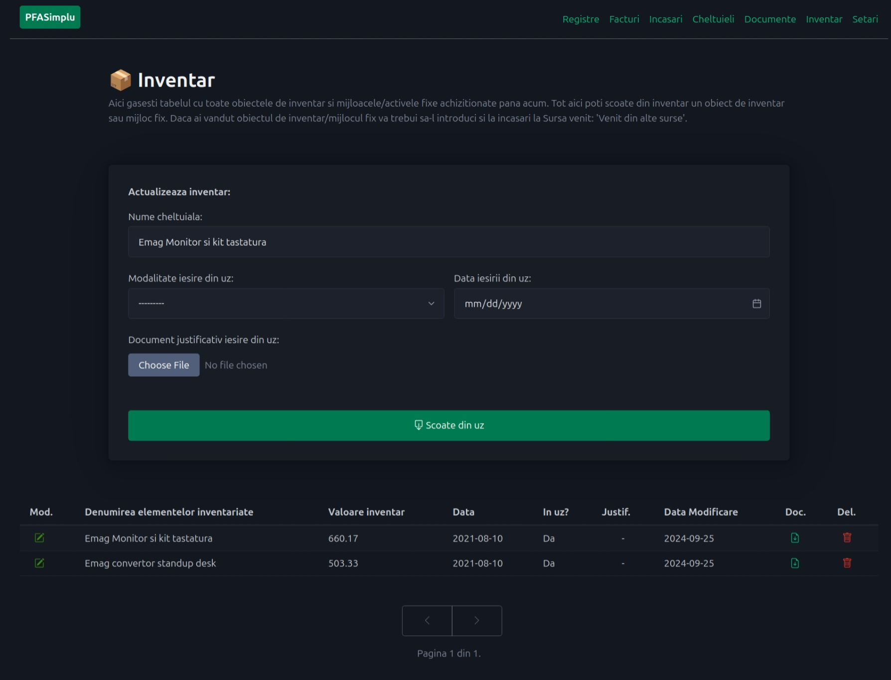
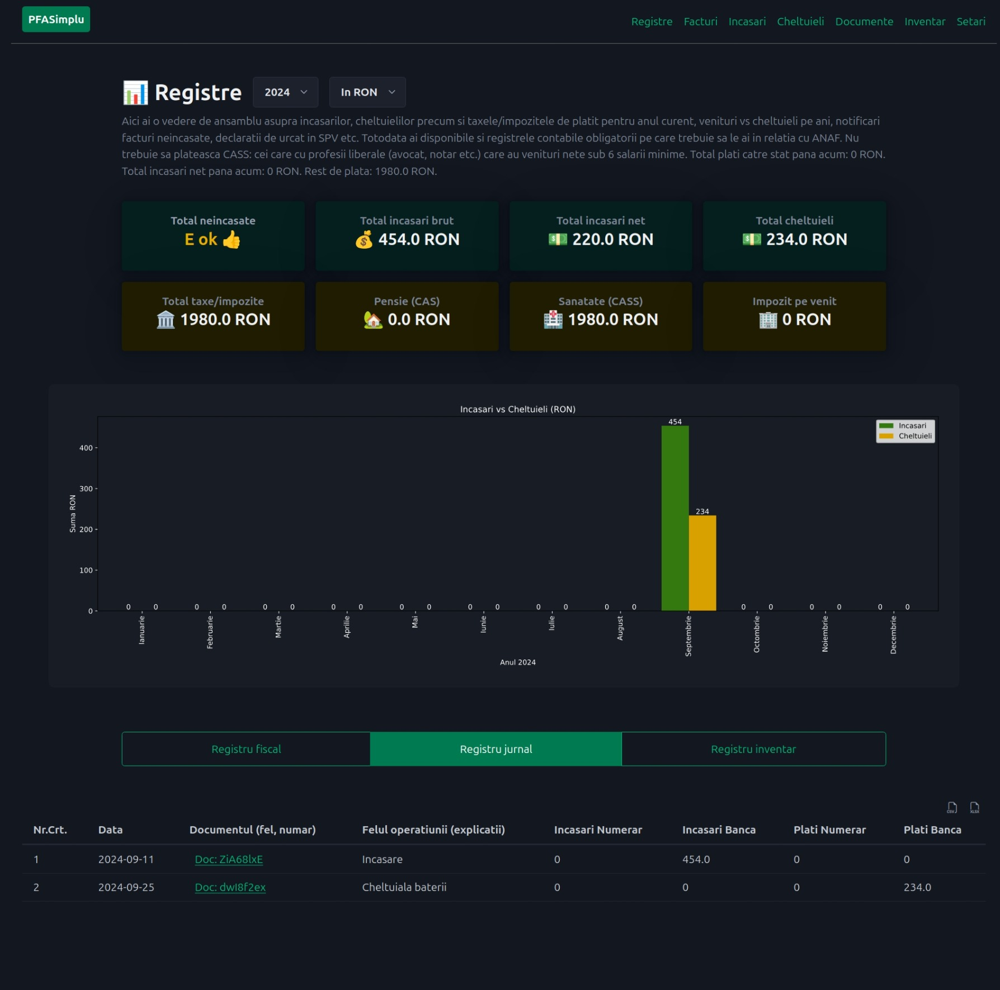
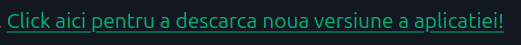
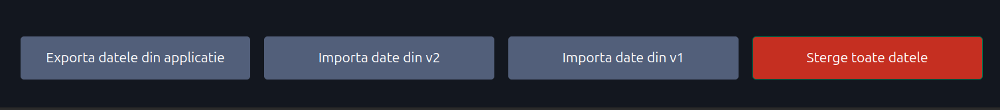

# PFASimplu

Aplicatie pentru simplificarea gestiunii contabilitatii facuta in partida simpla (versiunea 2).  

<!-- START doctoc generated TOC please keep comment here to allow auto update -->
<!-- DON'T EDIT THIS SECTION, INSTEAD RE-RUN doctoc TO UPDATE -->
**Table of Contents**  *generated with [DocToc](https://github.com/thlorenz/doctoc)*

- [Pentru cine este de folos aceasta aplicatie?](#pentru-cine-este-de-folos-aceasta-aplicatie)
- [Poate aplicatia sa faca X,Y,Z?](#poate-aplicatia-sa-faca-xyz)
- [Instalare pt. utilizatori](#instalare-pt-utilizatori)
- [Instalare pt. developeri](#instalare-pt-developeri)
- [Setari](#setari)
- [Facturi](#facturi)
- [Incasari](#incasari)
- [Cheltuieli](#cheltuieli)
- [Documente](#documente)
- [Inventar](#inventar)
- [Registre](#registre)
- [Actualizare aplicatie](#actualizare-aplicatie)
- [Ce fac cu versiunea veche a aplicatiei (v1)?](#ce-fac-cu-versiunea-veche-a-aplicatiei-v1)
- [Observatii](#observatii)

<!-- END doctoc generated TOC please keep comment here to allow auto update -->

## Pentru cine este de folos aceasta aplicatie?

- Pentru cei care detin PFA, PFI, II, etc si pot tine contabilitatea in partida simpla;
- Impozitare in sistem real (fara norma de venit);
- Nu au depasit pragul TVA (venituri sub 5k euro pe luna);
- Sunt prestatori de servicii (freelanceri, instalatori, curieri glovo, tazz, soferi taxi, bold, uber etc.);

Aplicatia te ajuta sa:
- creezi facturi: e-factura (fara TVA), facturi PDF in mai multe limbi si valute;
- tii la curent toate registrele obligatorii pentru PFA (Registru Jurnal, Registru Fiscal, Registru Inventar);
- calculeaza automat cheltuielile deductibile partial si mijloacele fixe;
- arhivezi declaratiile depuse la ANAF;
- calculeaza automat taxele si impozitele datorate in functie de incasari/cheltuieli;

## Poate aplicatia sa faca X,Y,Z?

Aplicatia am facut-o potrivita pentru nevoile mele. Daca pe parcurs voi avea nevoie de X,Y,Z atunci poate voi actualiza aplicatia sa contina si X,Y,Z (cum am facut cu e-factura).

As fi vrut sa adaug mai multe functionalitati, dar nu am cunostinte solide de contabilitate. 
Daca deschizi un `New issue` din tabul `Issues` din aceasta pagina si spui pas cu pas care sunt cerintele voi lua in considerare sa adaug in aplicatie o noua functionalitate (in functie de timp si cunostinte).

## Instalare pt. utilizatori

Din sectiunea `Releases` din aceasta pagina descarca zip-ul pentru sistemul tau de operare. 
Odata descarcat click dreapta unzip si rulezi executabilul `pfasimplu.exe`.
Daca ai MacOS va trebui sa urmezi sectiunea *Instalare pt. developeri*. 

- [Click aici](https://github.com/ClimenteA/PFASimplu/releases) si descarca zip-ul din `Assets` pentru sistemul tau de operare (Windows, Ubuntu);

Daca executabilul nu functioneaza pe Windows va trebui sa instalezi [latest-microsoft-visual-c-redistributable-version x64 (click)](https://learn.microsoft.com/en-us/cpp/windows/latest-supported-vc-redist?view=msvc-170#latest-microsoft-visual-c-redistributable-version).

Executabilul nu are un certificat digital, asa ca sistemul de operare (windows/macos) iti va spune ca executabilul este un posibil virus sau ca este de la "un unknown publisher". Poti urma sectiunea *Instalare pt. developeri* daca vrei sa eviti asta. Sa fii safe: nu descarca acest executabil din alta locatie decat cea din acest GitHub repo!

## Instalare pt. developeri

Aplicatia este facuta in Python, Django cu SQLiteDB. 

- clone repo;
- `virtualenv .venv`;
- `source .venv/bin/activate` (pt. windows `Set-ExecutionPolicy Unrestricted -Scope Process` si `.\.venv\Scripts\activate`);
- `pip install -r requirements.txt`;
- `make migrate-all` - pt. Ubuntu pentru a face toate migrarile;
- `make run` - pt. a porni Django dev. server (aka `python manage.py runserver`);
- `make purge-db` - pt. a sterge `stocare.db` (sqlite db) si toate folderele `migrations`;
- `make purge-migration-dirs` - pt. a sterge toate folderele `migrations`;
- `make package` - creeaza aplicatia pfasimplu ca executabil pentru sistemul de operare pe care a fost rulat;

Pe windows comenzile make for avea prefixul `.\makefile.bat X` - unde X poate fi una din comenzile make linux de mai sus (ex: `.\makefile.bat run`).

## Setari 

In pagina `Setari` trebuie sa adaugi datele pfa-ului tau.
Poti importa datele din versiunea 1 sau versiunea 2. 
Poti sterge toate datele. 
Aceasta pagina trebuie completata la prima deschidere a aplicatiei.
Cam rar vei schimba datele din aceasta pagina.

## Facturi

In pagina `Facturi` poti crea facturi pentru clienti din afara tarii, precum si e-factura pentru B2B in Romania. 
Factura generata aici este valabila pentru **PFA-urile neplatitore de TVA**.
Odata ce datele sunt completate in formular ele vor putea fi folosite si pentru facturi viitoare.
Pentru e-factura valoarea din campul 'Alege localitatea' trebuie sa fie una din valorile sugerate pe masura ce tastezi.
Fisierul generat XML este conform [XML-UBL versiunea 1.0.3](https://www.anaf.ro/CompletareFacturaSimplificat/faces/factura/informatiigenerale.xhtml).
Validarea fisierului XML a fost facuta pentru standard [FACT1](https://www.anaf.ro/uploadxmi/).
Poti prelua date CUI firma [de aici.](https://mfinante.gov.ro/apps/agenticod.html?pagina=domenii).

Campurile: Serie, Numar factura vor fi completate automat in functie de facturile din trecut. 
Seria + numarul facturii sunt verificate sa fie unice in baza de date.
Pe masura ce completezi campul Nume Client vor aparea sugestii de clienti existenti - 
cu un click poti selecta clientul si formularul va fi completat automat.
In campul Tip factura poti alege sa generezi factura in alta limba (non e-factura). 
Poti schimba si valuta in care emiti factura.

Din coloanele XML si PDF poti descarca facturile generate. In dreapta sus a tabelului sunt 2 butoane pentru a descarca toate facturile in format CSV sau XLSX. In coloana Del. poti sterge o factura.

Optional: Daca dai click pe Mai mult vei putea completa si alte date alte clientului precum:
Nr.Registru Comertului, Telefon, Email, Data Emitere factura (completata automat pentru ziua curenta), Data scadenta (calculata automat la 30 in viitor fata de ziua curenta) si Nota (unde poti adauga niste mentiuni in factura).

## Incasari

Aici poti aduga documentele justificative (facturi, chitante) prin care ai incasat bani oferind produse sau servicii cu PFA-ul tau. Daca ai incasari din alte surse decat din emitere facturi/bonuri selecteaza o alta sursa a venitului. In cazul incasarilor in alta moneda decat RON conversia va fi facuta automat la cursul zilei anterioare setata in campul 'Data incasarii'. Completeaza 'Data incasare' doar daca ai incasat banii, lasa campul gol daca nu ai incasat inca (vei putea modifica mai tarziu). Sumele incasate in alta valuta (EUR,USD etc) - sumele sunt convertite in RON in functie de 'Data incasare'.

Cu un click intr-o celula din coloana Mod. poti modifica o incasare. Din coloana Doc. poti descarca o incasare si in coloana Del. poti sterge o incasare. Daca trebuie sa adaugi mai mult de un document poti crea un zip cu toate documentele necesare.

## Cheltuieli

Aici poti aduga documentele justificative (facturi, chitante) pentru cheltuielile pe care le-ai facut in scopul prestarii activitatii tale de PFA. Unele cheltuieli sunt integral deductibile: consumabile, plati servicii, achizitii bunuri sub 2500 RON etc. Altele sunt partial deductibile: 2% din baza de calcul pentru cheltuielile cu potentialii clienti (mancare, cadouri sub 100 RON, etc), 50% cheltuieli cu autovehicul/chirii/utilitati daca sunt folosite si in scop personal. Unele cheltuieli au nevoie de documente justificative in plus pe langa bonul sau factura care justifica cheltuiala. Cheltuielile care depasesc prag mijloc fix vor trebui amortizate in functie de codul de clasificare din tabelul de amortizare mijloace fixe. Achizitiile/Cheltuielile care nu isi pierd valoarea in timp cum ar fi terenuri, aur, case nu sunt deductibile. Daca trebuie sa adaugi mai mult de un document poti crea un zip cu toate documentele necesare.

Campul Deductibila contine si cheltuielile deductibile partial care vor fi calculate automat in functie de datele existente in aplicatie.

Atunci cand ai de adaugat un obiect de inventar cu valoarea peste 2500 RON trebuie sa selectezi `Mijloc fix peste 2500 RON (ded. integral cu amortizare)`. In campul nume cheltuiala poti vedea valorile pentru mijloace fixe. Campul Nume cheltuiala poate fi folosit pentru a filtra tipul cheltuielii.

Uite un exemplu pentru a amortiza o cheltuiala amortizabila cu un Laptop. 
Cel mai apropiat de un laptop in tabel este valoarea `Calculatoare electronice` care are codul `2.2.9.` 
si o perioada de amortizare intre 2 si 4 ani. 

> Amortizare: 2-4 ani. COD: '2.2.9.' din GRUPA 2. INSTALATII TEHNICE, MIJLOACE DE TRANSPORT, ANIMALE SI PLANTATII - 2.2. APARATE SI INSTALATII DE MASURARE, CONTROL SI REGLARE.. Active fixe: Calculatoare electronice si echipamente periferice. Masini si aparate de casa, control si facturat.

Odata introduse aceste date, aplicatia va calcula automat amortizarea acelui activ fix.

## Documente

Aici poti introduce documentele create in relatia cu ANAF. Declaratii, dovezi plati taxe si impozite si alte documente pe care le consideri importante. Daca nu ai depasit plafonul TVA de 300000 RON pe an (cca. 60.000 EUR, 5440 Euro/luna, 31 Eur/Ora, 6 saptamani libere) si nu ai angajati (poti avea 3 angajati) singura declaratie pe care trebuie sa o completezi este Declaratia Unica 212. Daca ai depasit plafonul TVA sau ai angajati poate un SRL ar fi mai potrivit. Daca nu gasesti tipul declaratiei alege 'Document' si completeaza in campul 'Mentiuni' detalii despre documentul incarcat.

In cazul dovezii platii de impozite (pdf-ul primit de la ghiseul.ro) si al declaratiei unice datele relevante sunt automat extrase din PDF-ul incarcat.

## Inventar

Aici gasesti tabelul cu toate obiectele de inventar si mijloacele/activele fixe achizitionate pana acum. Tot aici poti scoate din inventar un obiect de inventar sau mijloc fix. Daca ai vandut obiectul de inventar/mijlocul fix va trebui sa-l introduci si la incasari la Sursa venit: 'Venit din alte surse'. 

Pentru a scoate un obiect de inventar din uz trebuie sa dai click in coloana Mod. pe iconita de modificare. 
Formularul va fi completat cu datele salvate anterior pe care acum le poti modifica si salva.

Deasupra tabelului in dreapta vei gasi 2 iconite pentru a descarca tot tabelul incasari. 

## Registre

Aici ai o vedere de ansamblu asupra incasarilor, cheltuielilor precum si taxele/impozitele de platit pentru anul curent, venituri vs cheltuieli pe ani, notificari facturi neincasate, declaratii de urcat in SPV etc. Totodata ai disponibile si registrele contabile obligatorii pe care trebuie sa le ai in relatia cu ANAF. Nu trebuie sa plateasca CASS: cei care cu profesii liberale (avocat, notar etc.) care au venituri nete sub 6 salarii minime. 

Poti alege sa vezi sumele din grafic si total carduri in EUR sau RON. 
Si da, nu e gresit chiar daca ai 0 incasari (sau sub 6 salarii minime) trebuie sa platesti CASS ~2000 RON. 
Poti descarca registrele dand click fie pe iconita de csv sau xlsx. 
In cazul Registrului jurnal si Registrului Inventar un fisier zip va fi descarcat in folderul Downloads care va contine datele registrului intr-un fisier xlsx sau csv (depinde ce icon ai ales) si un folder Documente in care vor fi toate documentele justificative. Toate fisierele salvate in aplicatie for avea un prefix id de 8 caractere dupa care le puteti gasi (ex: `0x4rf2KW_Factura_etc.pdf`).  

## Actualizare aplicatie

Daca a aparut o noua versiune a aplicatiei in pagina Registre va aparea linkul din imagine in descrierea paginii.
La prima deschidere a aplicatiei este posibil ca mesajul "Click aici pentru a descarca noua versiune a aplicatiei" sa apara - da click butonul din stanga sus PFASimplu pentru a da refresh la pagina.

Un click pe cel link te va duce catre pagina de Github Releases (pagina de unde ai descarcat prima data aplicatia).
Din Assets descarca ultima versiune pentru sistemul tau de operare. 

Din pagina Setari a aplicatiei "veche" click pe buttonul `Exporta datele din aplicatie` (un zip va fi descarcat in folderul Downloads/Descarcari). 

Acum trebuie unzip la aplicatia noua (cea cu versiunea mai mare ce ai descarcat-o anterior din Github releases).
Langa executabilul `pfasimplu.exe` da unzip la zip-ul creat cand ai dat click pe butonul Exporta datele din aplicatie.

Deschide aplicatia cu versiunea noua si in pagina Setari da click pe `Importa date din v2`. Aplicatia va lua datele din folderul stocare de langa executabil si va adauga in baza de date din _internal/dbsqlite datele din csv-uri si in folderul _internal/media documentele justificative.

## Ce fac cu versiunea veche a aplicatiei (v1)?

O poti folosi in continuare. Este actualizata cu datele pana in 2024 inclusiv.
Daca mai apar modificari de calcul al taxelor/impozitelor dupa 2024 atunci aplicatia anterioara (V1) nu mai este valabila.

**Recomand**: Versiunea 2 are si o optiune de preluare a datelor din versiunea 1. 
Tot ce trebuie sa faci este sa copii fisierul `stocare` langa executabilul `pfasimplu.exe` si din pagina `Setari` sa apesi butonul `Importa date din V1` apoi astepti cateva secunde. Doar un cont trebuie sa fie prezent in folderul stocare.

O alta optiune: Faci un zip cu aplicatia pfasimplu v1 (care contine registrele excel in folderul stocare) si il pui pe un usb stick pentru pastrare. Apoi, poti folosi v2.

## Observatii

**Aplicatia este oferita ca atare, nu are nici o garantie asociata**. Nu imi asumam raspunderea pentru eventuale erori in procesare date contabilitate, daune provocate dispozitivelor etc. Testeaza aplicatia inainte si vezi daca raspunde nevoilor tale inainte de o adauga in rutina de lucru.

Daca gasesti erori in aplicatie poti deschide un [`New issue`](https://github.com/ClimenteA/PFASimplu/issues/new) in tabul `Issues` din acesta pagina sau poti [posta pe reddit](https://www.reddit.com/r/PFASimplu/submit/?type=TEXT) in subredditul [PFASimplu](https://www.reddit.com/r/PFASimplu/).

😁 Daca ai de unde, nu ma supar sa primesc donatii:

Daca vrei sa inveti sa faci aplicatii web de la 0 am facut un curs de 15 ore (Python, Javascript, HTML/CSS, Docker, Mongo etc) - [click aici](https://curs.softgata.com/) pentru mai multe detalii.

Daca ai nevoie de o aplicatie web sau o automatizare a unui process de business ma poti contacta pe [ro.softgata.com](https://ro.softgata.com/). Imi poti trimite si un mesaj pe [linkedin](https://www.linkedin.com/in/climente-alin/) in caz de a picat hosting-ul pentru softgata.com 😅 (mai postez si acolo din cand in cand).
